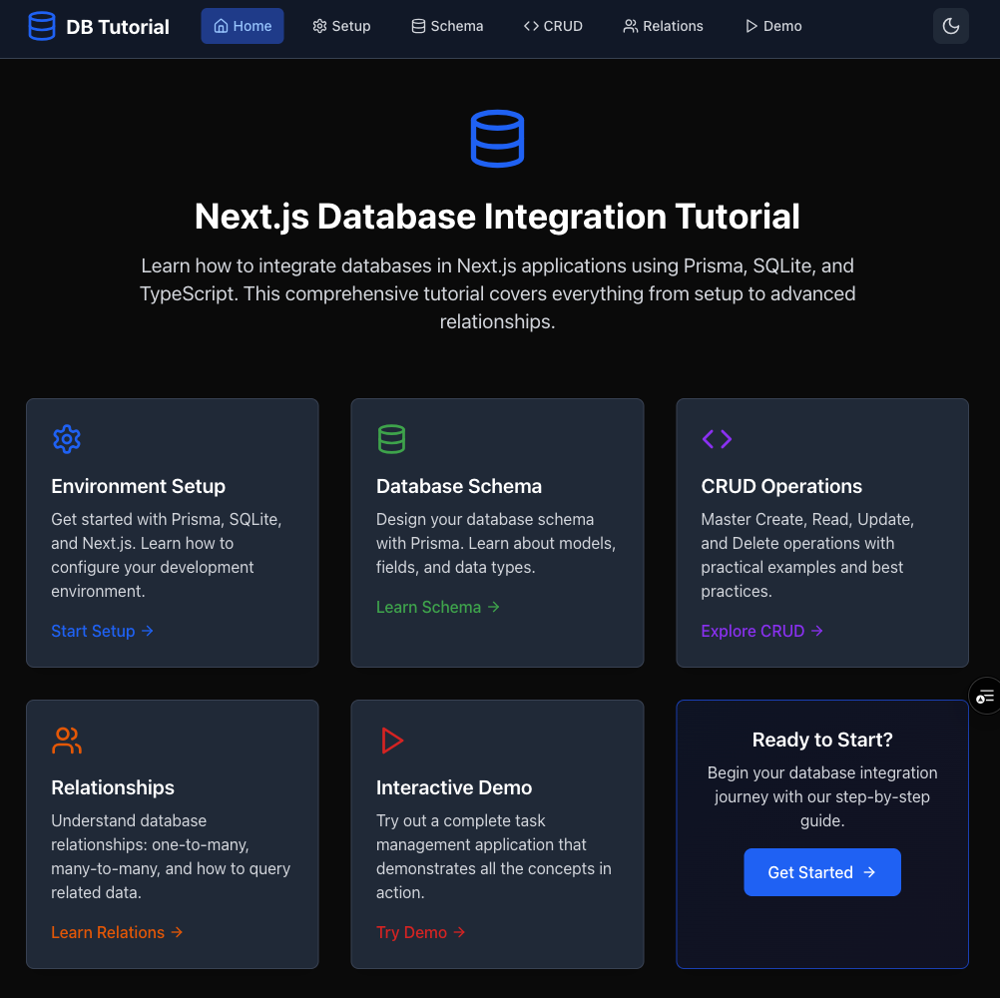

# 🗄️ Database Tutorial with Next.js & Prisma

> **A comprehensive tutorial project demonstrating modern database integration with Next.js, Prisma, and SQLite**

## 🌐 Live Demo

**[🚀 Visit the Live Demo](https://setting-up-database-tutorial.vercel.app/)**



## 📋 Table of Contents

- [🎯 What This Project Teaches](#-what-this-project-teaches)
- [🛠️ Prerequisites](#️-prerequisites)
- [⚡ Quick Start](#-quick-start)
- [📚 Detailed Setup Guide](#-detailed-setup-guide)
- [🎮 Interactive Demo](#-interactive-demo)
- [🏗️ Project Structure](#️-project-structure)
- [🔧 Available Scripts](#-available-scripts)
- [📖 Learning Resources](#-learning-resources)
- [🤝 Contributing](#-contributing)
- [📄 License](#-license)

## 🎯 What This Project Teaches

This tutorial covers essential database concepts and modern web development practices:

- 🗃️ **Database Design**: Creating schemas with relationships
- 🔗 **Prisma ORM**: Type-safe database operations
- 🎨 **Next.js 15**: App Router, API Routes, and Server Components
- 🎭 **TypeScript**: Full type safety throughout the stack
- 🎨 **Tailwind CSS**: Modern, responsive UI design
- 🔒 **Security**: Input validation and error handling
- 🚀 **Deployment**: Frontend to Vercel, database options

## 🛠️ Prerequisites

Before you begin, ensure you have the following installed:

- 📦 **Node.js** (v18 or higher) - [Download here](https://nodejs.org/)
- 📦 **npm** or **yarn** or **pnpm** - Package manager
- 💻 **Git** - Version control
- 🧠 **Basic knowledge** of JavaScript/TypeScript

## ⚡ Quick Start

### 1. 📥 Clone the Repository

```bash
git clone https://github.com/raimonvibe/setting-up-database-tutorial.git
cd setting-up-database-tutorial
```

### 2. 📦 Install Dependencies

```bash
npm install
# or
yarn install
# or
pnpm install
```

### 3. 🗄️ Set Up the Database

```bash
# Set environment variable (Windows PowerShell)
$env:DATABASE_URL="file:./prisma/dev.db"

# Set environment variable (macOS/Linux)
export DATABASE_URL="file:./prisma/dev.db"

# Generate Prisma client
npx prisma generate

# Create and sync database
npx prisma db push

# Seed with sample data
npx tsx prisma/seed.ts
```

### 4. 🚀 Start Development Server

```bash
npm run dev
# or
yarn dev
# or
pnpm dev
```

### 5. 🌐 Open Your Browser

Visit [http://localhost:3000](http://localhost:3000) to see the application!

## 📚 Detailed Setup Guide

### Step 1: Environment Setup

Create a `.env.local` file in your project root:

```env
# Database Configuration
DATABASE_URL="file:./prisma/dev.db"
```

> 💡 **Tip**: The `.env.local` file is automatically ignored by Git for security.

### Step 2: Database Schema

The project uses Prisma with SQLite for simplicity. The schema includes:

```prisma
model User {
  id        String   @id @default(cuid())
  email     String   @unique
  name      String?
  tasks     Task[]
  // ... timestamps
}

model Category {
  id          String   @id @default(cuid())
  name        String   @unique
  description String?
  color       String   @default("#3B82F6")
  tasks       Task[]
  // ... timestamps
}

model Task {
  id          String    @id @default(cuid())
  title       String
  description String?
  completed   Boolean   @default(false)
  priority    Priority  @default(MEDIUM)
  dueDate     DateTime?
  
  userId      String
  user        User      @relation(fields: [userId], references: [id])
  
  categoryId  String?
  category    Category? @relation(fields: [categoryId], references: [id])
  // ... timestamps
}
```

### Step 3: Understanding the Structure

```
📁 src/
├── 📁 app/                    # Next.js App Router
│   ├── 📁 api/               # API Routes
│   │   ├── 📁 tasks/         # Task CRUD operations
│   │   ├── 📁 categories/    # Category management
│   │   └── 📁 users/         # User management
│   ├── 📁 demo/              # Interactive demo page
│   ├── 📁 setup/             # Setup instructions
│   └── 📁 schema/            # Database schema viewer
├── 📁 components/            # Reusable UI components
├── 📁 contexts/              # React contexts
└── 📁 lib/                   # Utility functions
    ├── db.ts                 # Prisma client setup
    └── seed.ts               # Database seeding
```

## 🎮 Interactive Demo

The project includes a fully functional demo at `/demo` that showcases:

- ✅ **Task Management**: Create, edit, delete, and complete tasks
- 🏷️ **Category System**: Organize tasks with colored categories
- 👥 **User Management**: Assign tasks to different users
- ⚡ **Priority Levels**: LOW, MEDIUM, HIGH, URGENT
- 📅 **Due Dates**: Set and track task deadlines
- 📊 **Real-time Statistics**: View completion metrics
- 📱 **Responsive Design**: Works on all devices

### Demo Features:

1. **Create Tasks** 🆕
   - Add title, description, priority, and due date
   - Assign to users and categories
   - Real-time validation

2. **Manage Categories** 🏷️
   - Create custom categories with colors
   - View task counts per category
   - Delete unused categories

3. **Track Progress** 📊
   - Mark tasks as complete/incomplete
   - View completion statistics
   - Filter by priority and status

## 🏗️ Project Structure

```
📁 setting-up-database-tutorial/
├── 📁 prisma/                 # Database configuration
│   ├── schema.prisma         # Database schema
│   ├── dev.db               # SQLite database file
│   └── seed.ts              # Sample data
├── 📁 src/
│   ├── 📁 app/              # Next.js App Router
│   ├── 📁 components/       # React components
│   ├── 📁 contexts/         # React contexts
│   └── 📁 lib/              # Utilities
├── 📁 public/               # Static assets
├── 📄 package.json          # Dependencies
├── 📄 next.config.ts        # Next.js configuration
├── 📄 tailwind.config.js    # Tailwind CSS config
└── 📄 vercel.json           # Vercel deployment config
```

## 🔧 Available Scripts

| Script | Description |
|--------|-------------|
| `npm run dev` | 🚀 Start development server with Turbopack |
| `npm run build` | 🏗️ Build for production |
| `npm run start` | 🎯 Start production server |
| `npm run lint` | 🔍 Run ESLint |
| `npx prisma studio` | 🎨 Open Prisma Studio (database GUI) |
| `npx prisma generate` | ⚡ Generate Prisma client |
| `npx prisma db push` | 📤 Push schema changes to database |
| `npx prisma db seed` | 🌱 Seed database with sample data |

## 📖 Learning Resources

### 🎓 Tutorial Pages

- **📋 Setup Guide** (`/setup`) - Step-by-step database setup
- **🗄️ Schema Overview** (`/schema`) - Database structure explanation
- **🔗 Relationships** (`/relationships`) - How data connects
- **🎮 Interactive Demo** (`/demo`) - Hands-on practice

### 📚 External Resources

- [Prisma Documentation](https://www.prisma.io/docs) - Complete Prisma guide
- [Next.js Documentation](https://nextjs.org/docs) - Next.js features
- [Tailwind CSS](https://tailwindcss.com/docs) - Utility-first CSS
- [TypeScript Handbook](https://www.typescriptlang.org/docs/) - TypeScript guide

## 🔒 Security Features

This project implements several security best practices:

- ✅ **Input Validation**: All API endpoints validate input
- ✅ **Type Safety**: Full TypeScript coverage
- ✅ **Error Handling**: Secure error messages
- ✅ **Data Sanitization**: Input trimming and normalization
- ✅ **Dependency Security**: Regular security updates

## 🚀 Deployment

Ready to deploy? Check out our [📄 PUBLISH.md](./PUBLISH.md) guide for:

- 🌐 **Frontend**: Deploy to Vercel (already configured!)
- 🗄️ **Database**: Multiple free database options
- 🔧 **Environment**: Production configuration
- 📊 **Monitoring**: Performance and error tracking

## 🤝 Contributing

We welcome contributions! Here's how to get started:

1. 🍴 **Fork** the repository
2. 🌿 **Create** a feature branch (`git checkout -b feature/amazing-feature`)
3. 💾 **Commit** your changes (`git commit -m 'Add amazing feature'`)
4. 📤 **Push** to the branch (`git push origin feature/amazing-feature`)
5. 🔄 **Open** a Pull Request

### 🐛 Reporting Issues

Found a bug? Please create an issue with:

- 🖥️ **Environment**: OS, Node.js version
- 📝 **Steps**: How to reproduce
- 🎯 **Expected**: What should happen
- ❌ **Actual**: What actually happens

## 📄 License

This project is licensed under the MIT License - see the [LICENSE](LICENSE) file for details.

## 🙏 Acknowledgments

- [Next.js](https://nextjs.org/) - The React framework
- [Prisma](https://www.prisma.io/) - The database toolkit
- [Tailwind CSS](https://tailwindcss.com/) - The CSS framework
- [Lucide React](https://lucide.dev/) - Beautiful icons
- [Vercel](https://vercel.com/) - Amazing deployment platform

---

<div align="center">

**⭐ Star this repository if you found it helpful!**

[🌐 Live Demo](https://setting-up-database-tutorial.vercel.app/) • [📖 Documentation](./PUBLISH.md) • [🐛 Report Bug](https://github.com/raimonvibe/setting-up-database-tutorial/issues) • [💡 Request Feature](https://github.com/raimonvibe/setting-up-database-tutorial/issues)

Made with ❤️ by [raimonvibe](https://github.com/raimonvibe)

</div>